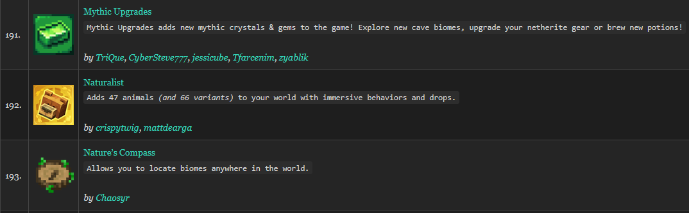

# sculkr

<center>


[](https://github.com/justin-carver/sculkr/actions/workflows/ci.yml)
[](https://crates.io/crates/sculkr)
[](https://github.com/justin-carver/sculkr/releases/latest)
[](https://github.com/justin-carver/sculkr/blob/main/Cargo.toml)
[](https://github.com/justin-carver/sculkr/releases/latest)
[](https://github.com/justin-carver/sculkr/blob/main/LICENSE)

A companion CLI application for `packwiz` that parses its output data to deliver advanced utility commands and extended features for Minecraft modpack development.

</center>

## Current Features

- Creates a **Minecraft** modlist from [packwiz](https://packwiz.infra.link/).

    The format of the modlist can be customized to your choosing, based on a collection of available placeholder/template strings, and it's output stored in a file or piped into other programs.

    See the [Formatting](#Formatting) section for more information.

## Installation

Requires Rust **1.88** or newer (edition 2024).

### From crates.io

```sh
cargo install sculkr
```

### Prebuilt binaries

Every tagged release ships archives for Linux, macOS, and Windows on the
[releases page](https://github.com/justin-carver/sculkr/releases/latest) — x86_64 and
aarch64 for Linux and macOS, x86_64 for Windows. Download the archive for your
platform, extract it, and put `sculkr` somewhere on your `PATH`.

Each release also carries `SHA256SUMS.txt` and a build provenance attestation:

```sh
# Checksums
sha256sum --check --ignore-missing SHA256SUMS.txt

# Provenance — proves the archive came from this repo's release workflow
gh attestation verify sculkr-<version>-<target>.tar.gz --repo justin-carver/sculkr
```

### From source

```sh
git clone https://github.com/justin-carver/sculkr.git
cd sculkr
cargo install --path .
```

## Configuration

`sculkr` reads its settings from the environment at run time, and loads a `.env`
from the working directory if one is present. Copy [`.env.example`](.env.example)
to `.env` to get started.

| Variable     | Required            | Value                                                                                                                                                           |
| ------------ | ------------------- | --------------------------------------------------------------------------------------------------------------------------------------------------------------- |
| `CF_API_KEY` | For CurseForge mods | A [CurseForge API key](https://console.curseforge.com/). Only requested when the pack actually contains CurseForge mods — a Modrinth-only pack never needs one. |

Quote `CF_API_KEY` with **single** quotes. CurseForge keys are bcrypt-shaped
(`$2a$10$...`) and dotenv expands `$VAR` inside double quotes, which silently
truncates the key and earns you a `403` with an empty body.

Nothing is read at compile time — `build.rs` fails the build if anything under
`src/` tries — so no key can be baked into a published binary.

## Usage

```sh
# Print the modlist to stdout (default Markdown list format)
sculkr

# Change the path to something relative or absolute
sculkr -p ~/modpack/mods

# Write it to a file instead of stdout
sculkr -p mods -o modlist.md

# Apply a custom template, one mod per line
sculkr -p mods -f '{INDEX}. {NAME} ({SLUG}) - {LICENSE_ID}\n'

# Debug logging on stderr, modlist still outputs cleanly to file
sculkr -p mods -vv -o modlist.md

# Just the mod names, nothing else
sculkr -p mods -q -f '{NAME}\n'

# Version, authors, repository
sculkr about

# View runtime information about sculkr and the modpack
sculkr config
```

`-p` defaults to the current directory, so point it at wherever your `*.pw.toml`
files live. Logs go to stderr, so a redirected or piped modlist stays clean.

## Formatting

`--format` / `-f` takes a string literal with `{PLACEHOLDER}` holes in it, one
per field the cache holds.

The default modpack output is (Markdown List format):

```
- [{NAME}]({URL}) - {DESCRIPTION}\n
```

```sh
# Markdown table rows
sculkr -f '| {NAME} | {AUTHORS} | {LICENSE_ID} |\n'
# HTML list-item anchor tags with a newline
sculkr -f '<li><a href="{URL}">{NAME}</a> — {DESC}</li>\n'
# Perhaps something a bit more complicated (see image below)
sculkr -f '| {INDEX}. |  | <a href="{URL}">{NAME}</a><br/><code>{DESC}</code><br/><br/><i>by {AUTHORS_MD}</i> |\n'
```



Backslash escapes (`\n`, `\t`, `\r`, `\0`, `\\`, `\{`, `\}`) are resolved by
sculkr rather than by the shell, so quote the template and write `\n`
wherever you want a line break — nothing is appended for you. Placeholder names
are case-insensitive, and a bad template is rejected before any API calls are
made.

| Placeholder               | Value                                                     |
| ------------------------- | --------------------------------------------------------- |
| `{ID}`                    | Project id (Modrinth base62, CurseForge numeric)          |
| `{SLUG}`                  | URL slug, e.g. `sodium`                                   |
| `{NAME}`, `{TITLE}`       | Project title                                             |
| `{DESCRIPTION}`, `{DESC}` | Short description / summary                               |
| `{URL}`                   | Project page on Modrinth/CurseForge                       |
| `{ICON_URL}`              | Project icon image                                        |
| `{SOURCE_URL}`            | Source repository                                         |
| `{ISSUES_URL}`            | Issue tracker                                             |
| `{WIKI_URL}`              | Wiki / documentation                                      |
| `{LICENSE}`               | License name                                              |
| `{LICENSE_ID}`            | License id, e.g. `MIT`                                    |
| `{LICENSE_URL}`           | License text                                              |
| `{AUTHORS}`               | Author names, or the owning organization, comma separated |
| `{AUTHOR_URLS}`           | Author pages, comma separated                             |
| `{AUTHORS_MD}`            | Authors as markdown links                                 |
| `{INDEX}`                 | This mod's position in the list, starting at 1            |

A placeholder with no value for a given mod renders as an empty string.

### Formatting Notes

Line breaks _inside_ a value are collapsed to single spaces before
substitution. Both Modrinth and CurseForge allow them in a description, and one arriving mid-entry
would otherwise split a list item or table row across lines — so the only line
breaks in the output are the ones custom format's request.

CurseForge exposes no license anywhere in its public API, even though it is shown on the project page. `{LICENSE*}` is
therefore empty for CurseForge mods.

Modrinth author names cost extra lookups, because a project is credited to a
_Team_ rather than to a list of users:

- Team members come from a bulk `/v2/teams` call, sorted owner-first so the
  credit line is stable between runs.
- A project owned by an _organization_ has an empty team, and the site credits
  the organization — so `{AUTHORS}` gets the organization
  (`Forgified Fabric API :: Sinytra`). This is the one place `sculkr` touches
  Modrinth's `/v3` API, which is documented as unstable, so a failure there
  logs a warning and leaves those authors empty rather than failing the run... perhaps it'll be stable later.

**Neither API lookup runs when every mod is already cached.**

> If you are getting rate-limited by an API, it is advisible to update the cache only once all mod changes are finished.

`sculkr --help` prints the same table, generated from the same source.

## Todo

Just a small list of things I'd like to implement that would probably elevate this app just a little bit more:

1. Cache, list, query dependencies for each mod.
2. Ability to have inline notifications regarding when a new update for a specific Minecraft version is available.
3. Display info regarding: (+ # of New Mods) or (- # Deleted mods), and their names, since last cache state.
4. Extend the cache db to include information about when mod was added (may help troubleshoot terrible mod issues!)
5. Bulk Edit / Bulk Modify mods based on regular expressions
6. (Idk if this can be done???) Ability to hook into log files and determine what mods/deps caused previous crashes.

## Issues & Contributions

If you encounter any bugs, have questions, or notice areas for improvement, your feedback is highly welcome! Please feel free to open an issue to report problems or suggest enhancements. If you'd like to contribute directly, you can also submit a PR with your proposed fixes or updates, and I'll get to it when I can.

See [CONTRIBUTING.md](CONTRIBUTING.md) for how to set up a development environment, what CI checks against, and how releases are cut.

---

_<strong>sculkr</strong> began as a fork of [packwiz-modlist](https://github.com/Ricky12Awesome/packwiz-modlist)
by Ricky12Awesome, rewritten and renamed with their consent ([discussion](https://github.com/Ricky12Awesome/packwiz-modlist/issues/4)).
Large portions and functionality have been rewritten from the ground-up, with more and more features being added monthly._

_I am currently going through the original `packwiz-modlist` args and attempting to port those over, changing functionality where it makes most sense, adding things here or there. If you have an idea, or would like something yourself, let me know!_

_Licensed under Apache-2.0; see [NOTICE](NOTICE)._
